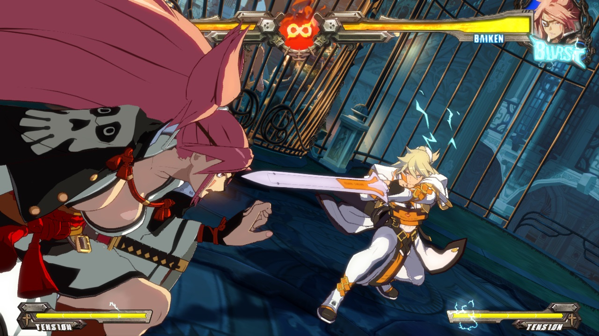
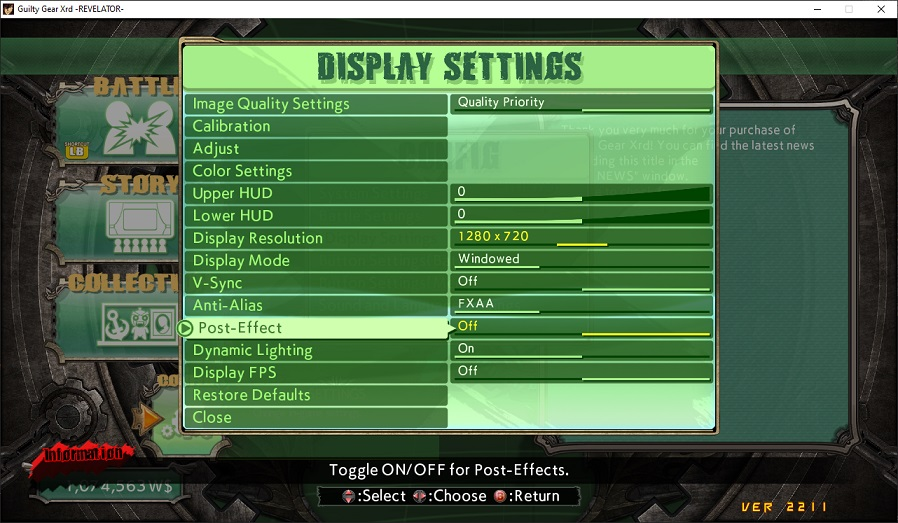

# ggxrd_freecam



## Description

Allows to move camera freely in Guilty Gear Xrd Rev2 version 2211 (as of 20'th November 2023).  
Also allows to play the game one frame at a time (only in training mode).  
Also allows to take screenshots of the game with transparency.  
No controller support (I don't own a controller).

## Credits

Thanks to WorseThanYou for reworking the mouse controls so that they work with the Raw input API.

## System requirements

Intel processor architecture x86 (32-bit) or x64 (64-bit) (AMD will work). Windows operating system.  
May work on Ubuntu/Linux running GGXrd under Steam Proton.

## Quickstart

1. Launch the game. Or you can do the next step at any point while the game is running.

2. Launch `ggxrd_freecam_injector.exe`.

3. Start a match. Freecam only works within matches, in training room, etc (also works while the game is paused using the game's built-in menu).  
   Left-click anywhere on the Guilty Gear's window and the camera should freeze. You can now move the camera freely (see `Controls` section). Left-click again and the camera should unfreeze. More in `Controls` section.

4. To play the game frame-by-frame refer to `Frame-by-frame Controls` section.

To turn off the mod you can launch `ggxrd_freecam_injector.exe` again.  
If trying to use the mod with a game version that it doesn't fit, the game may crash. The mod should be possible to combine with other mods, but there might be some mods that can't be combined with this one (if they hook or sigscan the same functions).

The mod may show up as a virus. I swear this is not a virus, check the source code, compile this yourself if still doubting. Check commit history of this repo to see no one else but me modified this. Add this to whatever antivirus exceptions necessary and run as administrator if necessary.

## Quickstart for Ubuntu/Linux

On Ubuntu/Linux the injector won't work. You need to patch the game so that it loads the DLL automatically on startup. The `ggxrd_freecam_patcher_linux` does exactly that and must be launched directly, without Wine. (Its Windows version, `ggxrd_freecam_patcher.exe`, can be used on Windows if you want to make the game load the mod automatically on startup.) The patcher on Ubuntu/Linux, when it asks, must be provided the full path to the game executable (`GuiltyGearXrd.exe`) without quotes.  
The patched game will now try to load the `ggxrd_freecam_dll.dll` on startup. In order for the game to find the DLL it must be placed in the same directory as the game executable, which should be in Steam's directory, for example: `~/.steam/debian-installation/steamapps/common/GUILTY GEAR Xrd -REVELATOR-/Binaries/Win32`, where `~` is your home directory.  
If the DLL is not found when the game launches, it will just run normally, without the mod.  
Since there's no way to unload the mod on Ubuntu/Linux (the injector doesn't work), you can add the `.ini` file mentioned in `Controls configuration` section into the folder with the game executable and change the line `startDisabled = false` to `startDisabled = true` in it and use the `disableModToggle` (no default hotkey) hotkey to enable the mod when you need.

If Steam Proton is taking forever to launch the game, patched or not, then rename the mod's dll and put the original, unpatched version of the game executable back, then try switching the Proton version in Steam's settings and agree to restart Steam. After restarting Steam will start downloading two things related to Guilty Gear Xrd and will launch GGXrd automatically (even though you didn't tell it to). GGXrd should work. Quit GGXrd. Place the patched version of the game executable and the mod's dll back and restart GGXrd. GGXrd will launch with the mod. Idk what causes this.

## Controls

Default controls are:

- Left-click anywhere on Guilty Gear's window: toggle freecam mode;
- Right-click anywhere on Guilty Gear's window: same as Left-click, except when exiting freecam mode the camera will remain frozen;
- F1: toggle (show/hide) HUD. Doesn't work on all of HUD elements, you may hide the remaining HUD elements using the game's built-in menus and ways to hide HUD;

While the freecam mode is on:

- Move mouse: look around;
- TFGH: move camera around the space;
- VBN: move camera up in space;
- Space: move camera down in space;
- PageDown: roll the camera to the right;
- PageUp: roll the camera to the left;
- Home: reset roll and FOV to their default values;
- Mouse wheel up: decrease FOV (field of view). This makes everything bigger;
- Mouse wheel down: increase FOV (field of view). This makes everything smaller;

Controls can be configured - more about that in `Controls configuration` section.

### Frame-by-frame Controls

The game can be played one frame at a time or in slow-motion mode. This is only allowed in training mode. Default controls are:

- F3 - freeze/unfreeze the game. Freezes the game and stops animations and game logic from advancing.
- F5 - advance to next frame. Use this while the game is frozen using F3.

Controls can be configured - more about that in `Controls configuration` section.

## Screenshotting

You can use this mod to take transparent or non-transparent screenshots of the game using `screenshotBtn` key combination (F8 by default - can be configured). To configure hotkeys, read `Controls configuration`.

### Setting up the game to enable transparent screenshots

To enabled screenshots taken to be with transparent background, you need to go into the game's `Display settings` and set `Post-Effect` to `OFF`.



Post-Effect set to Off seems to turn off anti-aliasing, but without it the trick won't work. Then you can load the mod and switch the `blackBackgroundToggle` (F2 is the default hotkey) to make the background black and that would actually make the background transparent - but you can't see that with a naked eye. You need to press "screenshotBtn" (F8, copies to clipboard by default) to take a screenshot and paste it into a graphical editor supporting transparency, like GIMP for example, in order to see transparency.  
Transparency in the game is actually inverted, meaning the background is fully opaque while the characters are fully transparent. The screenshotter inverts the alpha channel to make it correct.  
Only GIMP has been tested to support the PNG screenshot format that the mod produces, and this works on Windows and on Ubuntu/Linux, where Guilty Gear Xrd runs under Steam Proton.  

### Screenshot saving location

By default the mod saves the screenshot into clipboard buffer, meaning you can paste it afterwards into a graphics program which supports transparency. In order to save screenshots to a file or directory you can add the `ggxrd_freecam.ini` file into the same folder as the game executable and write the path into the `screenshotPath` setting in it, without quotes. Now when you save multiple screenshots in a row, each consecutive one will get a number in its name, increasing from 1 to infinity. Screenshots are never cleaned up, so if you never clean them up yourself, you might fill up your hard drive.  
The only supported format by the mod is PNG and it uses `libpng` to encode that. You don't need to do anything to install `libpng` since it should come working inside the DLL already.  

### Continuous screenshotting

You can use the `.ini` setting `allowContinuousScreenshotting` to make it so that as you hold down the `screenshotBtn` the screenshots get taken every game frame. This only includes non-frozen and non-paused game frames, i.e. only animation frames that are actually new. This feature only works under following conditions:

- The `screenshotPath` in the `.ini` is not empty;
- It only works in Training and Replay modes;
- A match (training session) must currently be running;
- The mod is not currently disabled using `disableModToggle` or `startDisabled`.

There's also a toggle you can use instead of holding down a button, and that toggle is the `continuousScreenshotToggle` setting in the `.ini`. It doesn't require `allowContinuousScreenshotting` to be set to `true` in order to work, can be any hotkey and toggles continuous screenshotting on and off, but it still works only under the aforementioned conditions.

### Non-transparent screenshotting

To take regular, non-transparency-enabled screenshots you can set the `dontUseScreenshotTransparency` setting to `true` in the `.ini` file (which must be placed into the game's folder).

### Converting PNGs into WEBP animation with transparency with ffmpeg

You can use ffmpeg (<https://www.ffmpeg.org/>) to convert multiple PNGs into one animation. Now, GIF could be used but it doesn't support semi-transparency: each pixel in GIF can only be either fully transparent or not transparent at all, which would ruin most animations containing special effects.  
WEBP supports full transparency and is an animation format. The command to transform PNGs into a WEBP is as follows:

```cmd
ffmpeg -framerate 4 -i imageFrameName%d.png -filter:v "crop=out_w:out_h:x:y" -quality 100 -loop 65535 webpFileName.webp
```

Make sure to substitute:  

- `ffmpeg` with the real location to the ffmpeg.exe on your computer;
- `-framerate 4` - make sure to substitute with the desired framerate, the higher the faster;
- `imageFrameName%d.png` with the path to the PNGs that you want to convert. The `%d` is the number part of the filename. So for example, if your PNGs are named like `screen1.png`, `screen2.png`, `screen3.png`, etc you would write here `screen%d.png`;
- `out_w`:`out_h`:`x`:`y` with the width and height of the cropping rectangle, x and y with the x and y of its top-left corner. You can get the bounding rectangle location by doing a selection in GIMP and maybe even in Paint;
- `-quality 100` - can be lowered of course to conserve file size;
- `webpFileName.webp` is the output webp file name. If you replace the `.webp` with `.gif` here and remove the `-quality` option, it might work for a GIF as well;

If any paths contain spaces (to ffmpeg, to the input PNGs, to the output WEBP) you must enclose them in quotation marks.

You can add a frame counter to the bottom of the animation using following ffmpeg command (taken from <https://stackoverflow.com/questions/15364861/frame-number-overlay-with-ffmpeg>):

```cmd
ffmpeg -framerate 2 -i imageFrameName%d.png -loop 65535 -vf "drawtext=fontfile=Arial.ttf: text='%{frame_num}': start_number=1: x=(w-tw)/2: y=h-(2*lh): fontcolor=black: fontsize=20: box=1: boxcolor=white: boxborderw=5" -c:a copy webpFileName.webp
```

Here I think `w` in `x=...` means width of the image, and `tw` is the width of the text. `h` is height of the image. Perhaps you can regulate the text position by setting the x and y to literal numbers. I'm sorry, I can't be of much help here.

### Converting PNGs into GIF animation with transparency with ffmpeg

This command takes a set of PNG screenshots labeled "screen1.png", "screen2.png", "screen3.png", etc (it's important that the numbers start from 0 or 1 or somewhere close to that) with transparency and converts them into a GIF with transparency with cropping with given framerate:

First generate a palette, so that we get the best quality of colors:

```cmd
ffmpeg -i screenspath\screen%d.png -vf palettegen=reserve_transparent=1 palettepath\palette.png
```

Not much we can customize in this.  
Then use the source images and the palette to produce a GIF:

```cmd
ffmpeg -framerate 20 -i screenspath\screen%d.png -i palettepath\palette.png -lavfi "crop=out_w:out_h:x:y,paletteuse=alpha_threshold=128:dither=floyd_steinberg" -gifflags -offsetting output\out.gif
```

Here the options you must replace are:

- `ffmpeg` - this is not an option, it's the command to be run, provide the full path to your ffmpeg.exe here;
- `-framerate 20` - replace 20 with desired framerate;
- `screenspath\screen%d.png` - the path to your screenshot PNG files. The %d is the number part of the filename. So for example, if your PNGs are named like screen1.png, screen2.png, screen3.png, etc you would write here screen%d.png;
- `crop=out_w:out_h:x:y` - this is the crop filter and its arguments. What a crop filter does is cut out only a part of the image. You must substitute `out_w` (width), `out_h` (height), `x` (top-left corner x) and `y` (top-left corner y) with the size and position of the cropping rectangle. You can get these positions by selecting a region of the image in GIMP or MSPaint;
- `,` - the `crop` filter and its arguments are then followed by `,`, which separates filters in a filter chain. The crop takes the first `-i` input as its input (crop has only one input) and produces one output. The first output of the `crop` filter and the second `-i` input (which is the palette) then go as inputs to the next, `paletteuse` filter;
- `paletteuse=` - this is the paletteuse filter and what follows are its arguments, separated by `:`;
- `alpha_threshold=128` - this is the first argument of the `paletteuse` filter. It specifies the cut-off alpha threshold after which the pixel is considered fully transparent. Since there's no partial transparency in GIF - only either full transparency or no transparency - this value is very important if there's partial transparency or some kind of special effects in your animation;
- `dither=floyd_steinberg` - this is the second argument of the `paletteuse` filter. It specifies dithering. Dithering is the process by which all the other colors that are not in the palette are achieved in GIF. Personally I find that the `floyd_steinberg` value produces the best results, but the other values that you could use for `dither` are: `bayer` (fixed grid (static) dithering - the classic look and feel of the GIF format), `none` (no dithering, I guess for when you got the colors in the palette exactly right or for 8-bit images).
- `gifflags`, `offsetting` - I don't know what these mean, got them from <https://stackoverflow.com/questions/53566442/ffmpeg-gif-with-transparency-from-png-image-sequence>;
- `output\out.gif` - the path to the GIF output file.

Again, if any paths contain spaces, you must enclose them in quotes. You can read about ffmpeg filter syntax on: <https://ffmpeg.org/ffmpeg-filters.html#toc-Filtering-Introduction>  
I will add that `-lavfi`, `-filter_complex`, `-vf`, `-af`, `-filter` mean exactly the same thing, which is a filtergraph. `:v` usually means the video part of an input, `:a` means the audio part of an input.

### Controls configuration

If you wish to configure key and/or mouse combinations for the controls, create a text file named `ggxrd_freecam.ini` and place it in the directory where the game executable is. For example, for me my Steam version of the game is located at `...\SteamLibrary\steamapps\common\GUILTY GEAR Xrd -REVELATOR-\Binaries\Win32`.  
Here's an example of the `.ini` file:

```ini
; To configure camera hotkeys place this file in the folder with the game executable
; For example it could be C:\Something\SteamLibrary\steamapps\common\GUILTY GEAR Xrd -REVELATOR-\Binaries\Win32
; You don't need to reload the mod when you change this file - it re-reads this settings file automatically when it changes.
; Available keys:
; Backspace, Tab, Enter, PauseBreak, CapsLock, Escape, Space, PageUp, PageDown, End, Home, ArrowLeft, ArrowUp, ArrowRight, ArrowDown, PrintScreen, Insert Delete, Num0, Num1, Num2, Num3, Num4, Num5, Num6, Num7, Num8, Num9, NumMultiply, NumAdd, NumSubtract, NumDecimal, NumDivide, F1, F2, F3, F4, F, F6, F7, F8, F9, F10, F11, F12, NumLock, ScrollLock, Colon, Plus, Minus, Comma, Period, Slash, Tilde, OpenSquareBracket, Backslash, CloseSquareBracket, Quote, Backslash2, LeftClick, RightClick, MiddleClick, MouseMoveLeft, MouseMoveUp, MouseMoveRight, MouseMoveDown, MouseWheelUp, MouseWheelDown, 0123456789, ABCDEFGHIJKLMNOPQRSTUVWXYZ, Shift, Ctrl, Alt
; You can specify key and key + mouse combinations by separating key names with the '+' sign.
; You can assign same key to multiple features - it will toggle/set in motion all of them simultaneously.

; Toggle freecam on/off
toggleFreecam = LeftClick

; Toggle freecam on/off, but when toggling off, free onnly the cursor and leave the camera position unchanged
toggleFreecamButLeaveLocked = RightClick

; Moves camera across space
moveCameraForward = T
moveCameraBackwards = G
moveCameraLeft = F
moveCameraRight = H
moveCameraUp = V
moveCameraUp = B
moveCameraUp = N
moveCameraDown = Space

; Rotates camera up/down/left/right
lookUp = MouseMoveUp
lookDown = MouseMoveDown
lookRight = MouseMoveRight
lookLeft = MouseMoveLeft

; Rolls camera left or right (think Lean in FPS games)
rollRight = PageDown
rollLeft = PageUp

; Resets roll back and FOV to their default values
resetRoll = Home

; Increase/decrease field of view. The smaller the FOV, the bigger everything is
fovDecrease = MouseWheelUp
fovIncrease = MouseWheelDown

; Hide/show HUD
toggleHud = F1

; Make background black (and transparent - see screenshotBtn)
blackBackgroundToggle = F2

; Hide all entities belonging to one of the fighting sides. This can't hide the tension/burst lightning.
; You can specify which exact side to hide using the opponentSide setting.
; This makes the hidden opponent somewhat invincible to all attacks except lows
hideOneOfTheSidesToggle = 

; This specifies which side to hide using hideOneOfTheSidesToggle. Specify 0 here for Player 1 Side
; and 1 for Player 2 Side
sideToHide = 1

; Multiplier for camera rotation speed up/down/left/right. Active always while looking around
lookaroundSpeedMultiplier = 1.0

; Multiplier for camera movement speed across space. Active always while moving
movementSpeedMultiplier = 1.0

; Multiplier for camera rolling speed (using rollRight/rollLeft). Active always while rolling
rollMultiplier = 1.0

; Multiplier for FOV change speed (using fovIncrease/fovDecrease). Active always while changing FOV
fovChangeSpeedMultiplier = 1.0

; Freezes the game
freezeGameToggle = F3

; Plays the game in slow motion. Specifies by how many times to slow the game down in "slowmoTimes"
slowmoGameToggle = 

; Only works while the game is frozen using freezeGameToggle. Advances the game forward one frame
allowNextFrameKeyCombo = F5

; This works in conjunction with slowmoGameToggle. Only round numbers greater than 1 allowed.
; Specifies by how many times to slow the game down
slowmoTimes = 3

; This toggle turns whole mod and all its features on/off (doesn't unload the DLL though).
; Convenient for turning the mod on after you've started the game with the mod turned off (see startDisabled)
disableModToggle = 

; Settings this to true makes the mod load initially in a disabled state, when none of its features,
; besides turning on the mod with the disableModToggle, work
startDisabled = false

; Takes a screenshot and saves it at screenshotPath path
; To take screenshots over a transparent background you need to go to the game's
; Display Settings and turn off Post-Effects, then use blackBackgroundToggle.
; Then screenshots will film character over transparent background
; If the dontUseScreenshotTransparency setting is true, screenshot will be without
; transparency anyway
screenshotBtn = F8

; setting "screenshotPath" specifies where screenshots will be saved.
; If you provided a file path it must be with extension, and if such name already exists a
; number will be appended to it, increasing from 1 to infinity consecutively so that it's unique.
; If you provided a directory path, it must already exist, and "screen.png" will be appended to
; it with an increasing number at the end in case the filename is not unique.
; The provided path must be without quotes.
; If you want the path to be multilingual you need to save this file in UTF-8.
; On Ubuntu/Linux running Guilty Gear Xrd under Steam Proton you need to specify paths with
; the Z:\ drive, path separator is backslash (\), not forward slash (/). Example: Z:\home\yourUserName\ggscreen.png
; If the path is not specified or is empty, the screenshot will be saved into your clipboard so
; it can be pasted into any image editing program. For example, GIMP will recognize the PNG
; format and paste that, with transparency. This would work even on Ubuntu/Linux.
; Only PNG format is supported.
screenshotPath = ; C:\YourUser\Desktop\screen.png

; When this is true that means screenshots are being taken every game loop logical frame as
; long as the screenshotBtn is being held. Game loop logical frame means that if the game is
; paused or the actual animations are not playing for whatever reason, screenshot won't be taken.
; A new screenshot is only taken when animation frames change on the player characters.
; Be cautions not to run out of disk space if you're low. This option doesn't
; work if screenshotPath is empty, it's not allowed to work outside of training or replay mode or when
; a match (training session) isn't currently running (for example on character selection screen).
allowContinuousScreenshotting = false

; This toggle can be used same way as screenshotBtn (when it's combined with
; allowContinuousScreenshotting = true), except it's a separate key combination and when you
; press it it toggles the continuous screenshot taking every game logical frame. This
; toggle does not require allowContinuousScreenshotting to be set to true
continuousScreenshotToggle = 

; Setting this to true will produce screenshots without transparency
dontUseScreenshotTransparency = false

```

You can specify a combination of keys and/or mouse buttons, separated by `+` sign. ; You can assign same key to multiple features - it will toggle/set in motion all of them simultaneously.  
Only the following key names are allowed: Backspace, Tab, Enter, PauseBreak, CapsLock, Escape, Space, PageUp, PageDown, End, Home, ArrowLeft, ArrowUp, ArrowRight, ArrowDown, PrintScreen, Insert Delete, Num0, Num1, Num2, Num3, Num4, Num5, Num6, Num7, Num8, Num9, NumMultiply, NumAdd, NumSubtract, NumDecimal, NumDivide, F1, F2, F3, F4, F, F6, F7, F8, F9, F10, F11, F12, NumLock, ScrollLock, Colon, Plus, Minus, Comma, Period, Slash, Tilde, OpenSquareBracket, Backslash, CloseSquareBracket, Quote, Backslash2, LeftClick, RightClick, MiddleClick, MouseMoveLeft, MouseMoveUp, MouseMoveRight, MouseMoveDown, MouseWheelUp, MouseWheelDown, 0123456789, ABCDEFGHIJKLMNOPQRSTUVWXYZ, Shift, Ctrl, Alt.  
You don't need to reload the mod when you change this file - it re-reads this settings file automatically when it changes.

## Build instructions

There are two separate projects in the solution.

The `ggxrd_freecam_injector` project builds an application that will inject a dll into the process and exit. The main action will then take place in the dll, in the target process' address space.

The `ggxrd_freecam_dll` project builds the dll that's responsible for the freecam functionality.

Both applications need to be compiled as 32-bit (x86) projects. Open the `.sln` file, which is located in the root of the repository, using Visual Studio (I'm using 2022 Community Edition). In the top bar select `Release` and `x86`.

The dll project must be compiled with UNICODE unset. Right-click the `ggxrd_freecam_dll` project in `Solution Explorer` and go to `Properties` -> `Advanced` -> `Character Set`. Select `Use Multi-Byte Character Set`. This setting is set separately for each `Release` + `x86` combination so it might change after changing the target platform.

The injector project must be compiled with UNICODE to support multi-language directory paths. Right-click the `ggxrd_freecam_injector` project in `Solution Explorer` and go to `Properties` -> `Advanced` -> `Character Set`. Select `Use Unicode Character Set`.

Add dependencies to the dll project: read below.

## Development dependencies

The dll part of the project depends on:

- Microsoft Detours library: <https://github.com/microsoft/Detours> Follow their instructions on how to build the `.lib` static library. You need to build the 32-bit (x86) version.  
  In order to link the static library you must right click the project in `Solution Explorer`. Go to `Properties` -> `VC++ Directories`. Add the full path to the `Detours-main\include` folder in the `Include Directories` field.  
  Add the full path to the `Detours-main\lib.X86` directory to the `Library Directories` field.  
  In the project settings property pages go to `Linker` -> `Input` and add `detours.lib` into the `Additional Dependencies` field.  
  This project uses version 4.0.1 of Detours dated Apr 16, 2018.

- `libpng` - a PNG encoder library. This is needed for the transparent/not-transparent screenshotting functionality. You should statically link its 32-bit verion into this mod. Its sources are not included in the mod in any way, you must download and build it yourself. libpng homepage: <http://www.libpng.org/pub/png/libpng.html>  
After you download the sources, make sure to also download the `zlib` (<https://www.zlib.net/>) sources and put the `zlib` sourcetree directory in the parent directory relative to `libpng` sourcetree and rename the `zlib` sourcetree directory to `zlib` if it's not already named that. Just to recap, the directory tree should look like this:

- The directory containing both `libpng` and `zlib`:
  - `libpng` sourcetree directory - can be named anything
  - `zlib` sourcetree directory - must be named exactly `zlib`

You don't need to compile `zlib` separately because it will get included as a subproject in `libpng` and will get compiled when you build the `libpng` solution.

In the `libpng` folder go to `projects\vstudio` and open the `vstudio.sln` solution file in Visual Studio. If Visual Studio asks to Retarget Projects, agree.  
In the top bar of Visual Studio choose build configuration `Release Library` (just `Release` seems to compile a DLL (with a `.lib` file, but that `.lib` requires the DLL actually still), while `Release Library` compiles a static `.lib` library) and `Win32`.  
Then go to `Build` -> `Build Solution`. Everything should succeed. The build files will be written to `projects\vstudio\Release Library`. We need the `libpng16.lib` and the `zlib.lib` files.  
Open the `ggxrd_freecam` solution, right-click the `ggxrd_freecam_dll` project and select `Properties`. Navigate to `VC++ Directories` and add the full path to the `libpng` sourcetree into the `Include Directories`. Add the full path to `libpng`'s `projects\vstudio\Release Library` directory into the `Library Directories` field. Navigate to `Linker` -> `Input` and add `libpng16.lib` and `zlib.lib` into the `Additional Dependencies` field.  
This will include `libpng` and `zlib` statically (meaning it's included into whatever you've built) into the `ggxrd_freecam_dll.dll` so you don't need to ship anything extra with the `ggxrd_freecam_dll.dll` to get PNG functionality working.

After setting UNICODE support correctly and adding dependencies you can build the project and the resulting `.exe` and `.dll` will appear in the `REPO_ROOT\Release` folder.

## Changelog

- 20'th November 2023 - added transparent/non-transparent screenshotting.
